# Proxmox Deployment — Stalwart Monitoring Stack

> Bare-metal deployment of **Prometheus + Grafana** on a dedicated VM, scraping metrics from a **Stalwart Mail Server** VM — both hosted on Proxmox.

**NB :** For a better  visualization, Obsidian is  recommanded 

---

## Architecture

```
Stalwart VM (192.168.100.218)              Monitoring VM (192.168.100.217)
┌──────────────────────────┐               ┌──────────────────────────────┐
│  Stalwart Mail Server    │               │  Prometheus (bare metal)     │
│  :8080/metrics/prome ────┼───────────────┼──► scrape every 15s          │
│  Ubuntu 22.04 LTS        │               │  Grafana :3000               │
│  4 vCPU / 4GB RAM        │               │  Ubuntu 22.04 / 4vCPU / 4GB  │
└──────────────────────────┘               └──────────────────────────────┘
```

---

## VM 1 — Monitoring Server (Prometheus + Grafana)

### 1. Install Prometheus

```bash
sudo apt update && sudo apt install -y prometheus
sudo systemctl enable --now prometheus
```

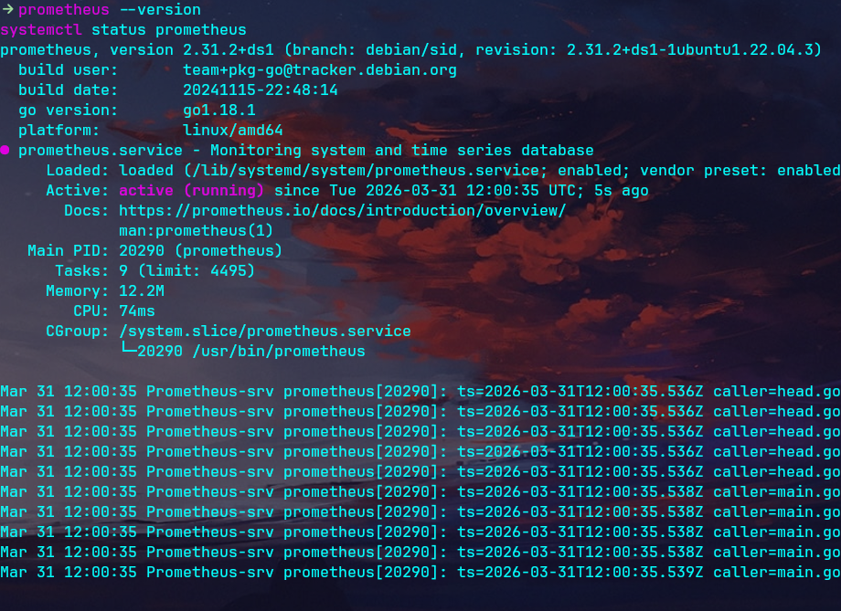

Access it at `http://192.168.100.217:9090`

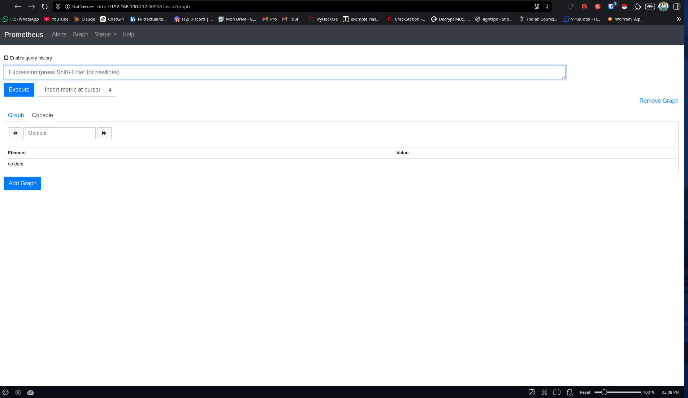

---

### 2. Install Grafana

```bash
sudo apt install -y apt-transport-https software-properties-common
wget -q -O - https://packages.grafana.com/gpg.key | sudo apt-key add -
echo "deb https://packages.grafana.com/oss/deb stable main" | sudo tee /etc/apt/sources.list.d/grafana.list
sudo apt update && sudo apt install -y grafana
sudo systemctl enable --now grafana-server
```

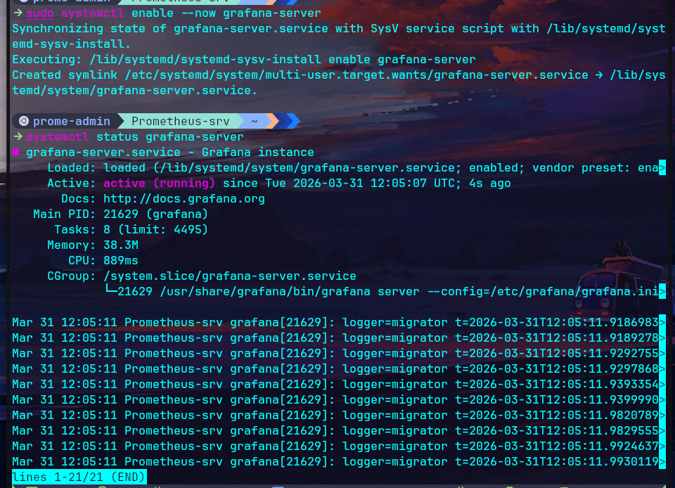

Access it at `http://192.168.100.217:3000`

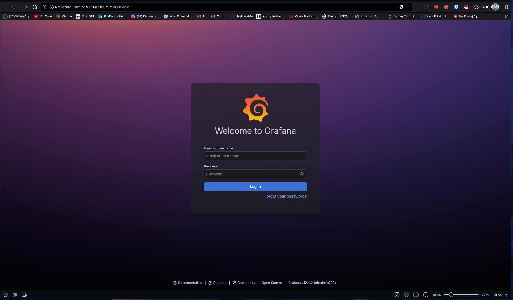

---

## VM 2 — Stalwart Mail Server

### 1. Install Stalwart

```bash
curl -fsSL https://get.stalw.art/install.sh | sudo bash
sudo systemctl enable --now stalwart
```

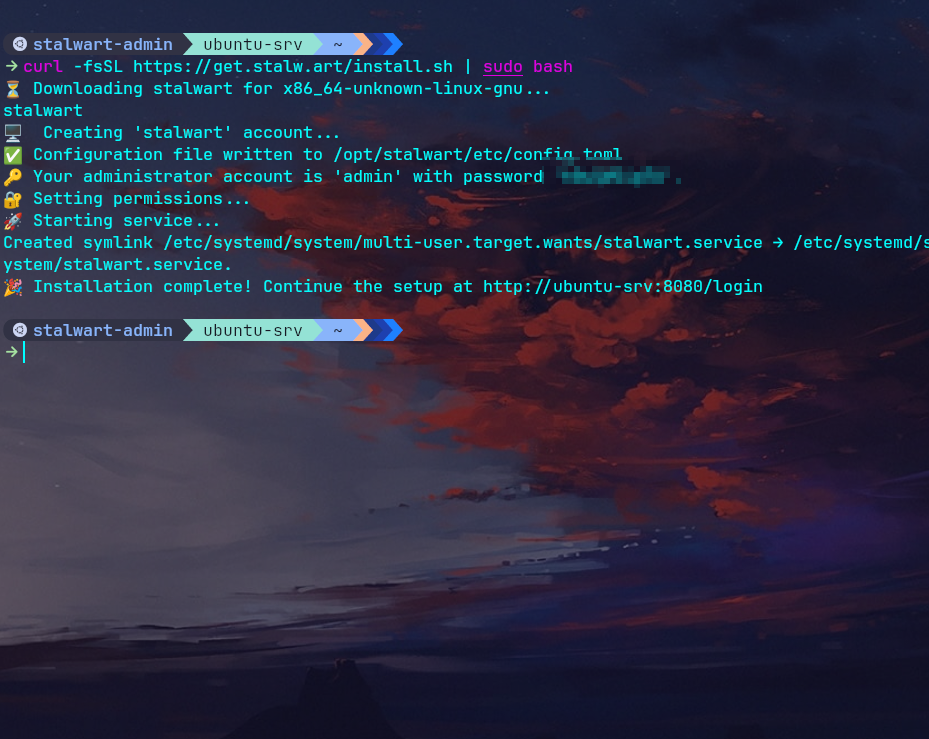

---

### 2. Enable Prometheus Metrics

The endpoint is disabled by default. Append to the config:

```bash
sudo nano /opt/stalwart/etc/config.toml
```

```toml
[metrics.prometheus]
enable = true
```

```bash
sudo systemctl restart stalwart
curl http://localhost:8080/metrics/prometheus
```

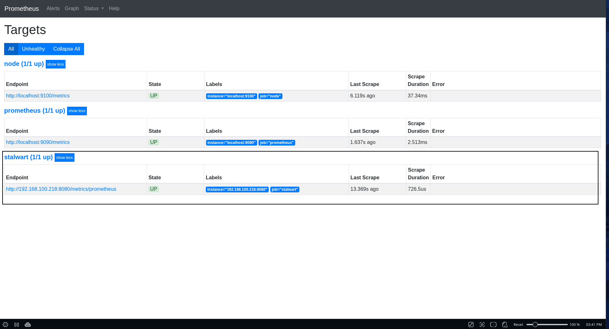

---

## Connecting the Stack

### 1. Point Prometheus at Stalwart

On the **Monitoring VM**, edit `/etc/prometheus/prometheus.yml` and add under `scrape_configs`:

```yaml
  - job_name: 'stalwart'
    metrics_path: '/metrics/prometheus'
    static_configs:
      - targets: ['192.168.100.218:8080']
```

> ⚠️ The `- job_name` must be indented with **2 spaces** under `scrape_configs` — missing indent breaks YAML parsing and Prometheus won't start.

```bash
sudo systemctl restart prometheus
```

Verify at `http://192.168.100.217:9090/targets` — stalwart should show **UP**.

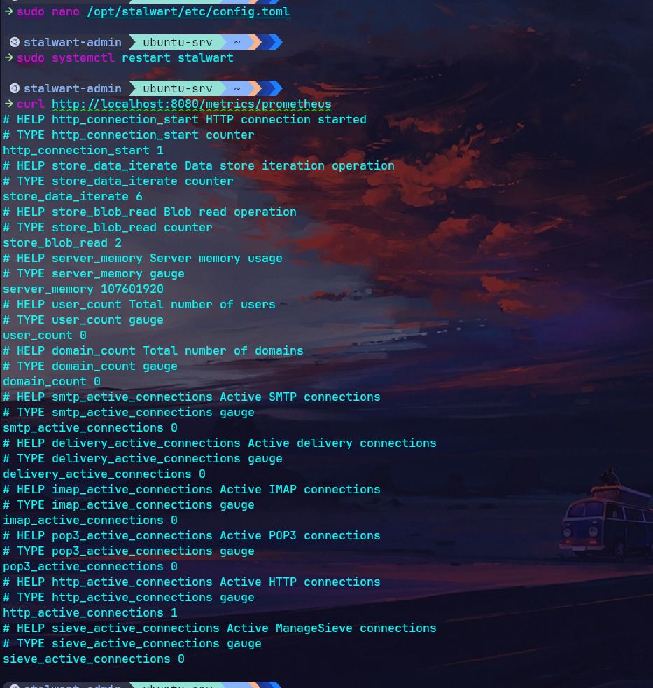

---

### 2. Add Prometheus as Grafana Data Source

In Grafana → **Connections** → **Data sources** → **Add data source** → **Prometheus**

Set URL to `http://localhost:9090` → **Save & test**

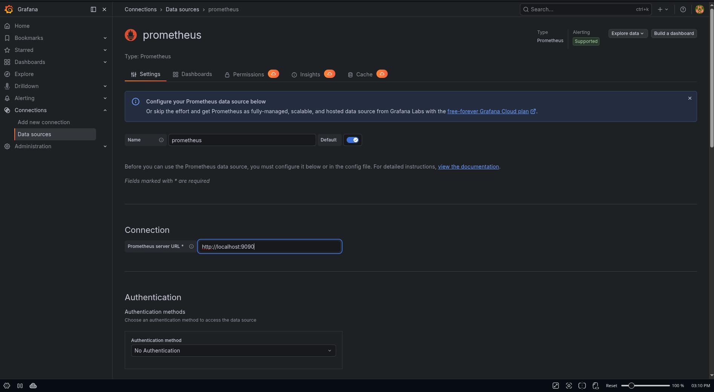

---

### 3. Import the Stalwart Dashboard

**Dashboards** → **New** → **Import** → ID `23498` → **Load** → select Prometheus → **Import**

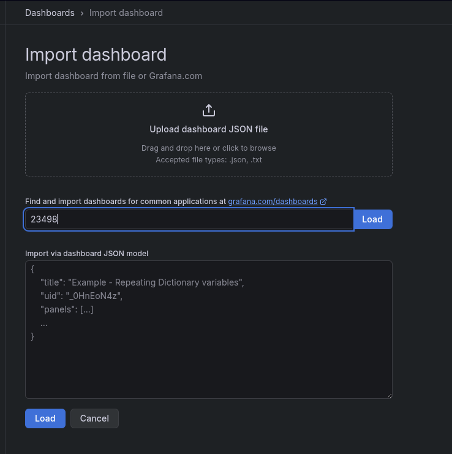

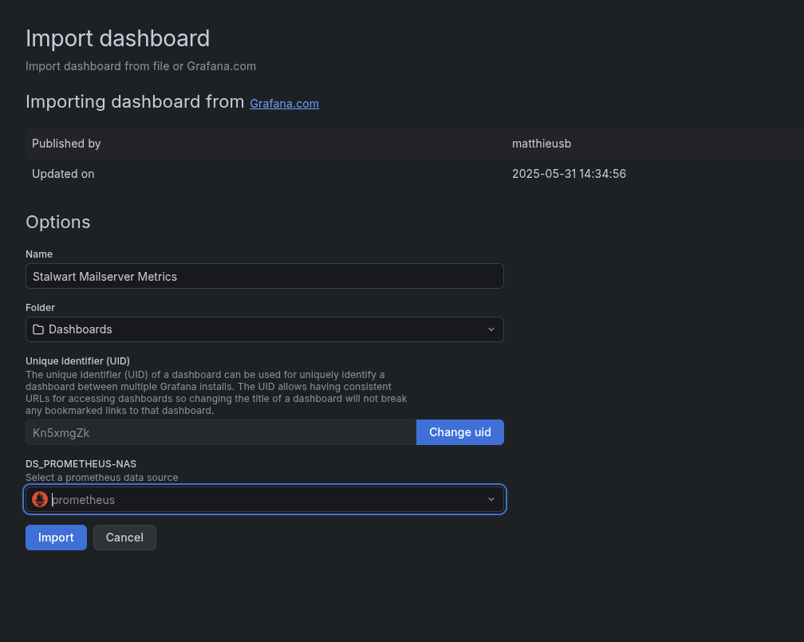

Initial dashboard view (panels show N/A — see Known Issue below):

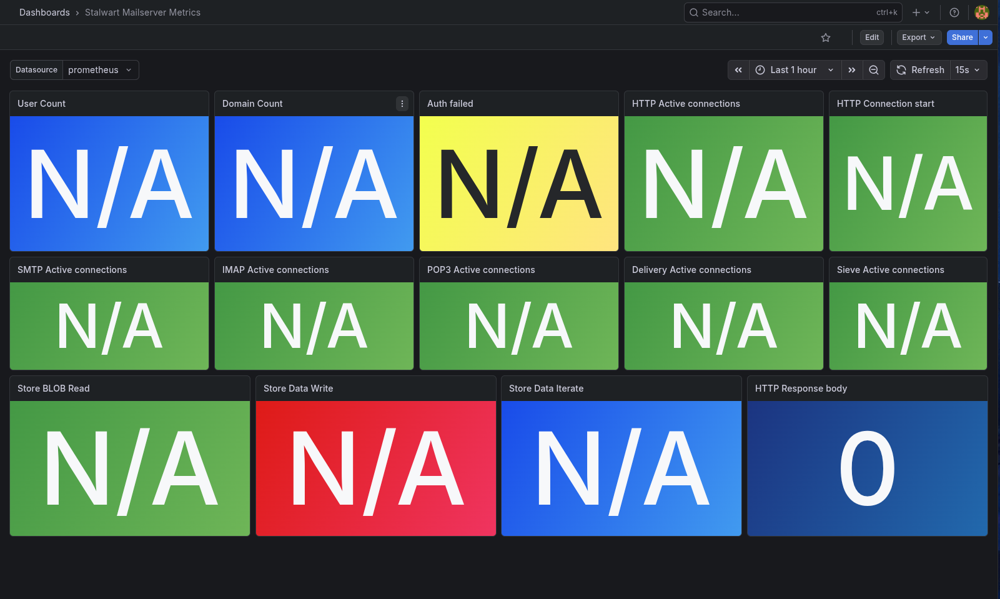

---

## Result

After applying the corrected dashboard JSON, Prometheus scrapes Stalwart successfully and Grafana displays live metrics.

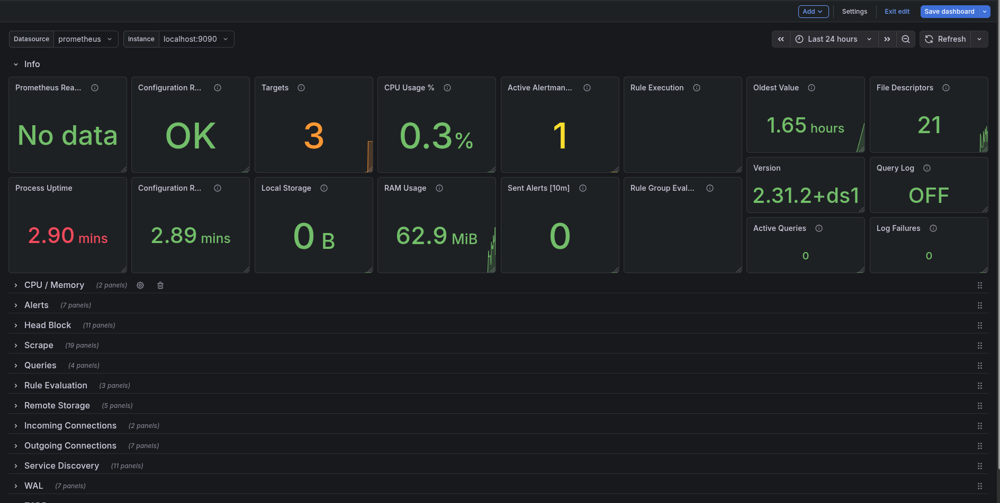

---

## Known Issue — Metric Name Prefix Mismatch

Dashboard `23498` was created for an older Stalwart version that prefixed all metrics with `stalwart_`.  
Modern Stalwart versions no longer use this prefix, which causes every panel to display `N/A` when the dashboard is imported.

**Fix:** Use the corrected dashboard JSON provided in this repository. All metric queries have been updated accordingly:

| Broken Query                               | Actual Metric                |
|--------------------------------------------|------------------------------|
| `stalwart_user_count`                      | `user_count`                 |
| `stalwart_domain_count`                    | `domain_count`               |
| `stalwart_auth_failed`                     | `auth_error`                 |
| `stalwart_http_active_connections`         | `http_active_connections`    |
| `stalwart_smtp_active_connections`         | `smtp_active_connections`    |
| `stalwart_imap_active_connections`         | `imap_active_connections`    |
| `stalwart_delivery_active_connections`     | `delivery_active_connections`|
| `stalwart_http_response_body`              | `http_response_body`         |
| `stalwart_store_data_write`                | `store_data_write`           |
| `stalwart_store_blob_read`                 | `store_blob_read`            |

**Result:** The updated configuration in `stalwart.json` restores full dashboard functionality.  

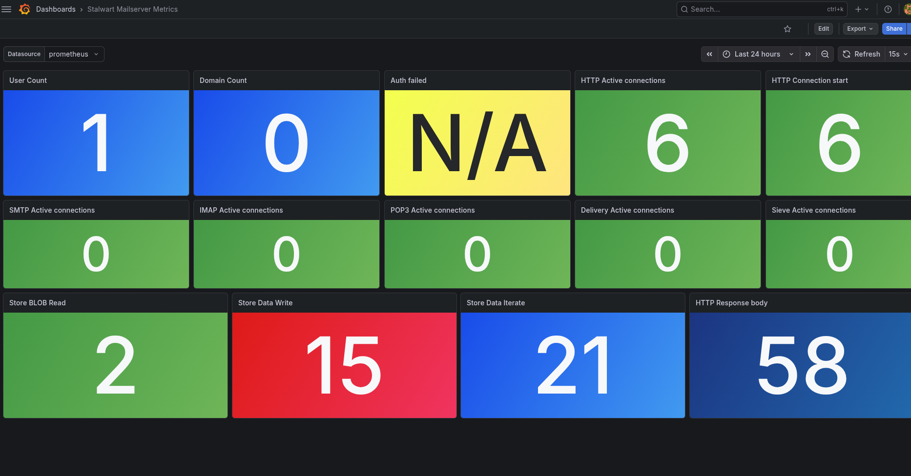

## Next Steps

- [ ] Keycloak IAM setup on the Stalwart VM
- [ ] Grafana alerting on `auth_error` spikes
- [ ] `node_exporter` on both VMs for system metrics
- [ ] Basic auth on the Stalwart metrics endpoint
- [ ] Domain and user configuration in Stalwart

---

