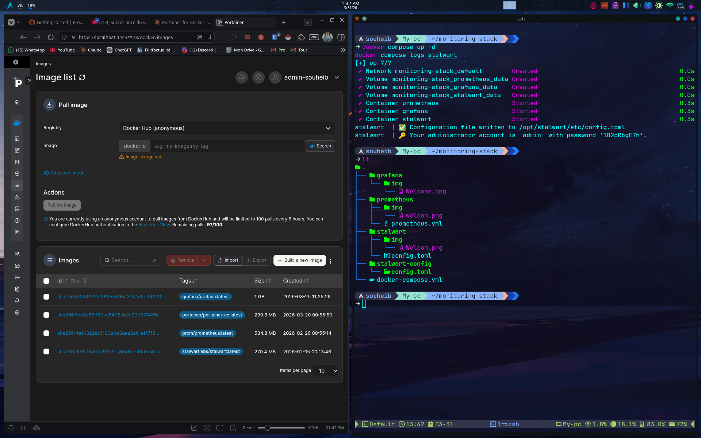
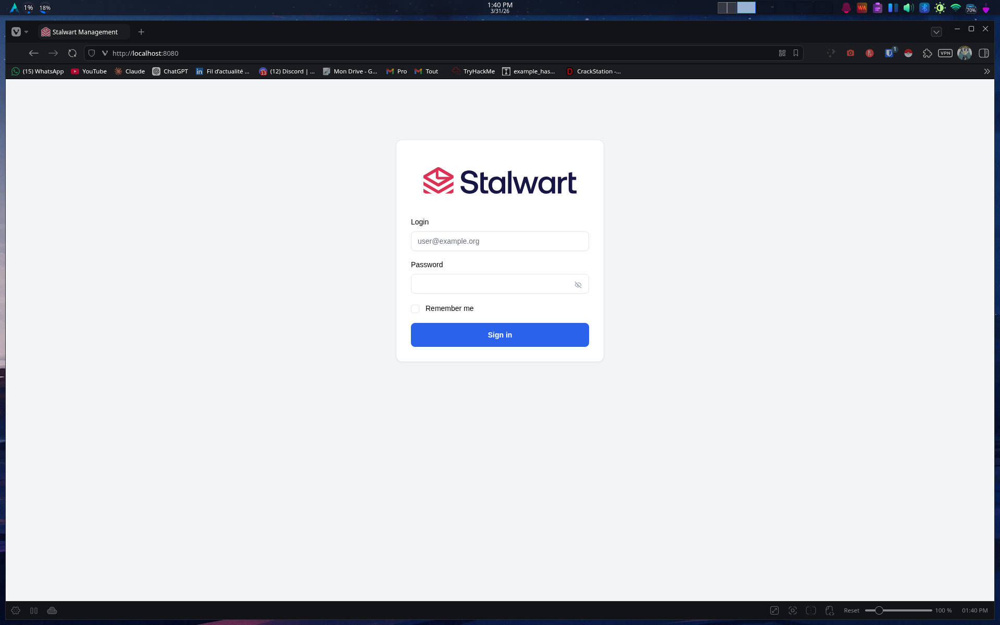
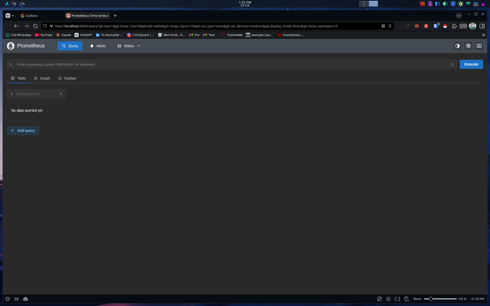
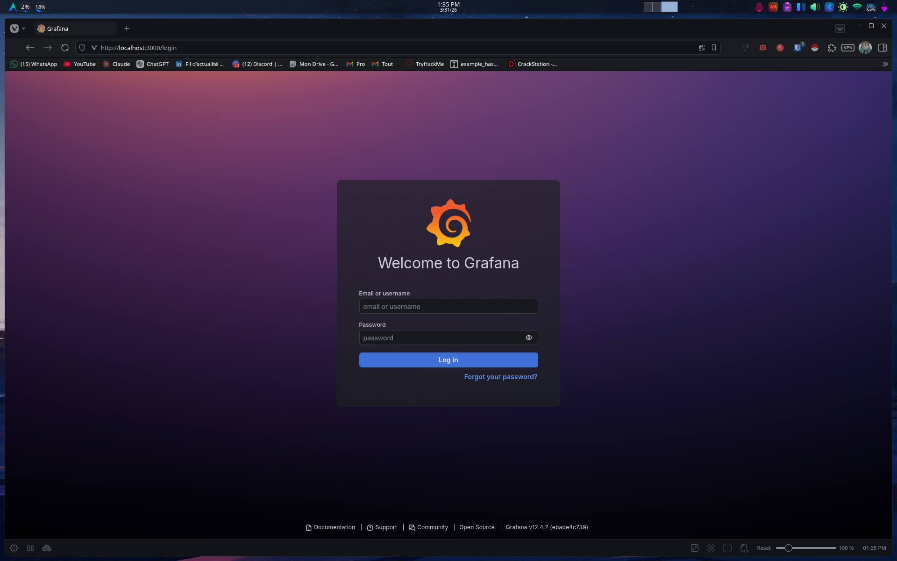
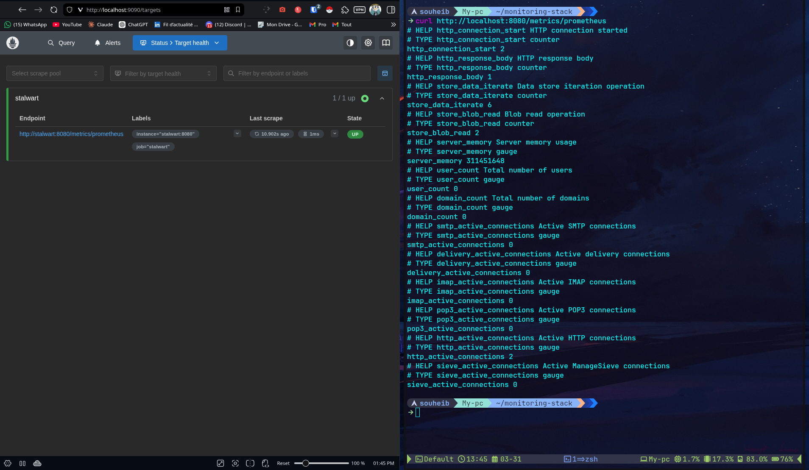
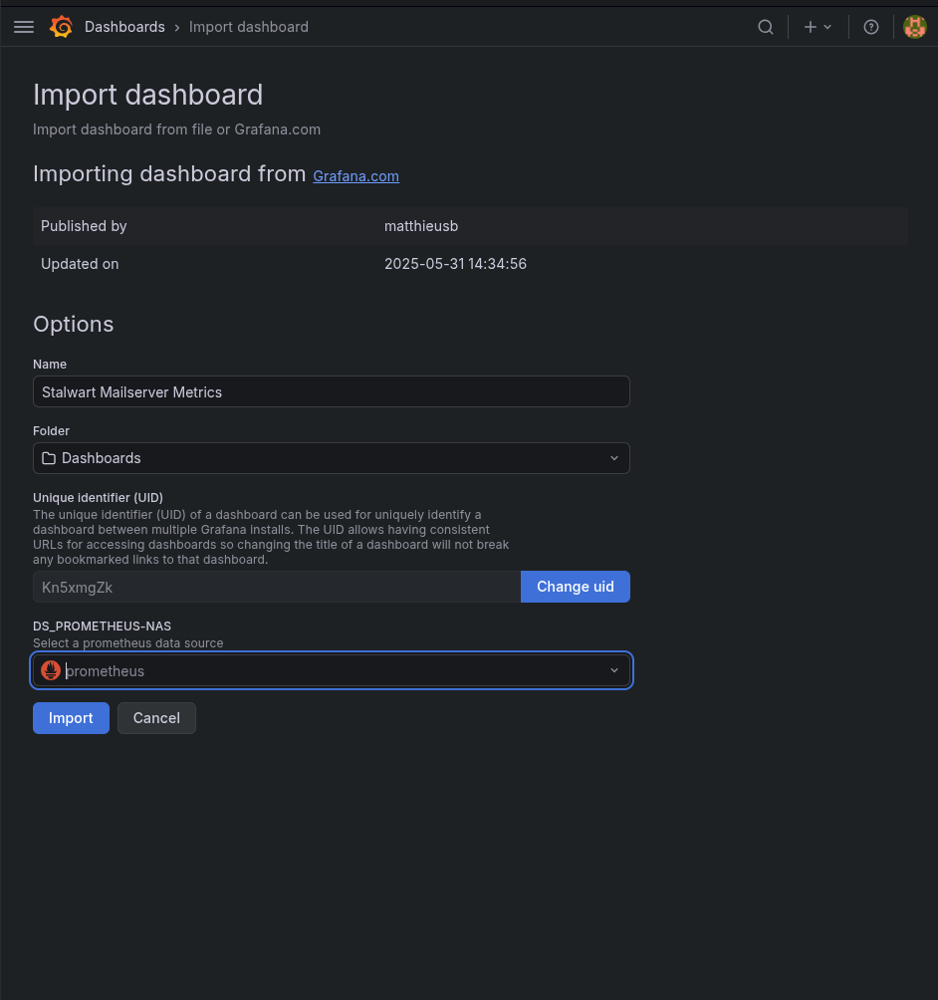
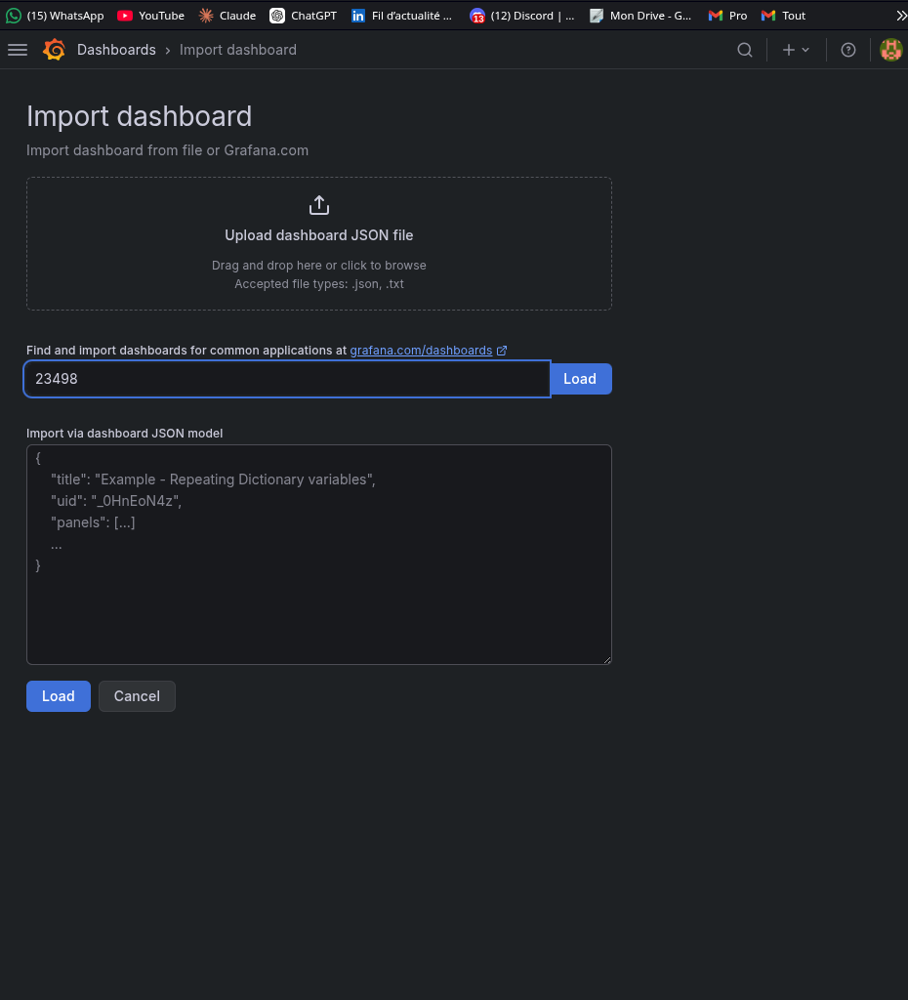
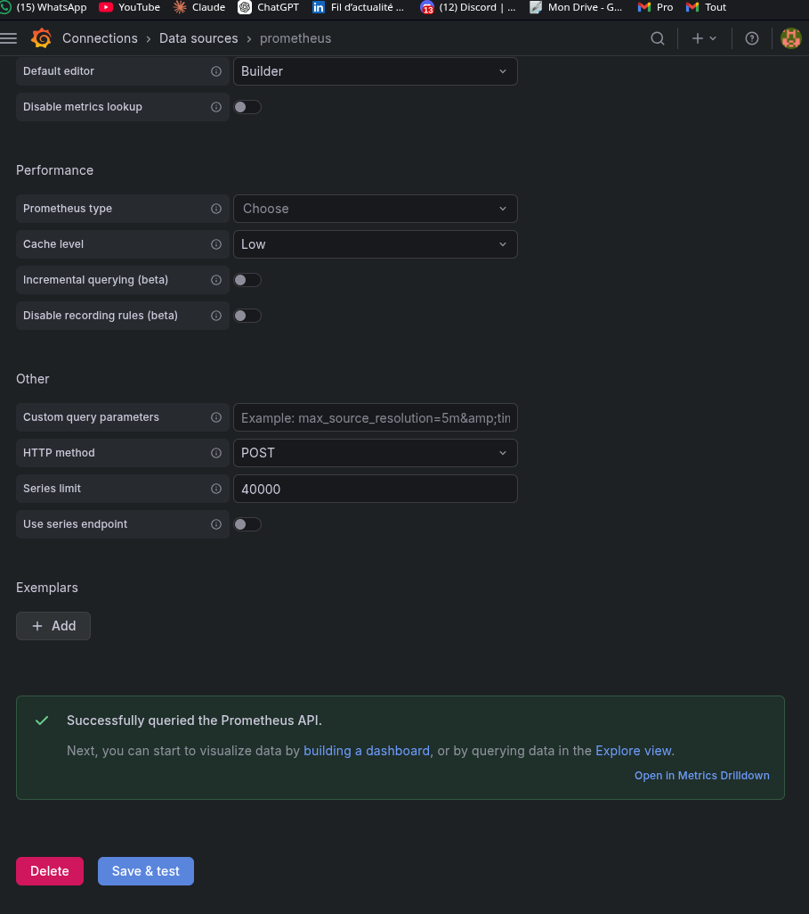
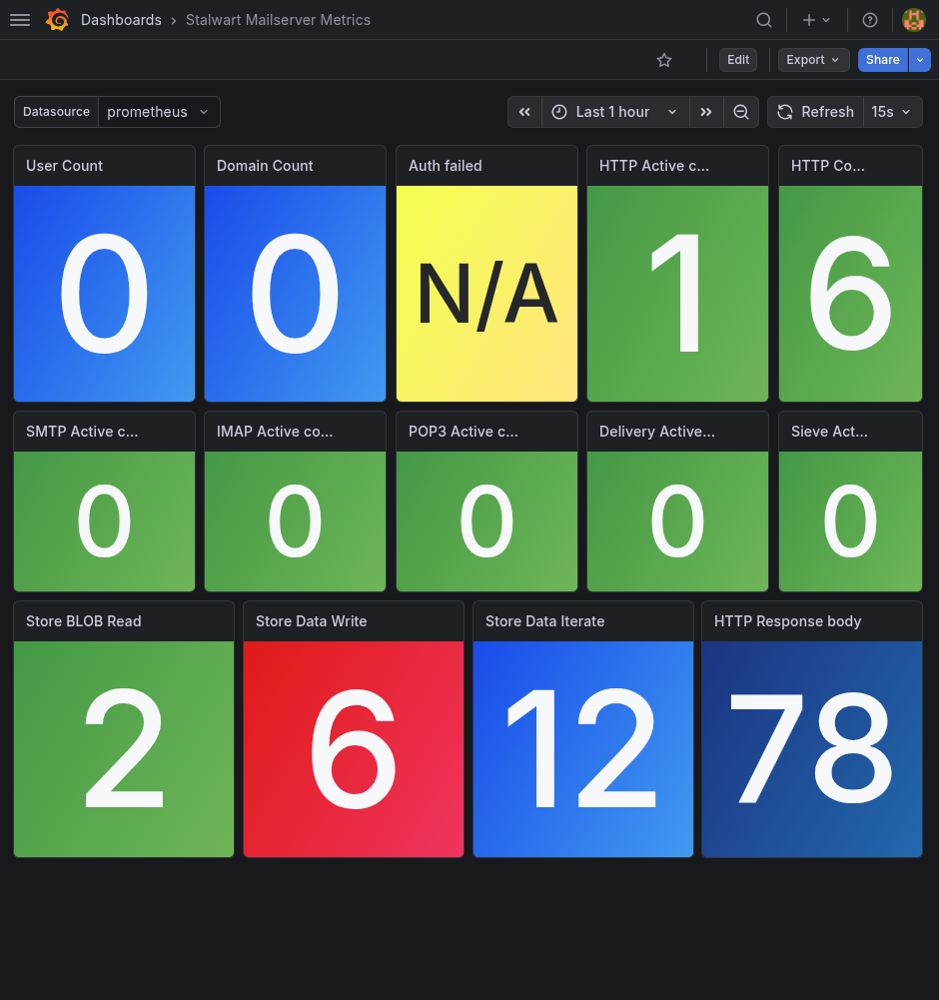

# Stalwart Mail Server Monitoring Stack

A self-contained Docker-based monitoring stack for [Stalwart Mail Server](https://stalw.art), using **Prometheus** for metrics scraping and **Grafana** for visualization. Built and tested locally via Docker, designed to be replicated on a production VM (e.g. Proxmox).

---

## Stack Overview

```
Stalwart ──/metrics/prometheus──► Prometheus ──► Grafana
```

| Service    | Image                          | Port(s)                          |
|------------|-------------------------------|----------------------------------|
| Stalwart   | `stalwartlabs/stalwart:latest` | 8080 (admin/metrics), 25, 143, 587 |
| Prometheus | `prom/prometheus:latest`       | 9090                             |
| Grafana    | `grafana/grafana:latest`       | 3000                             |

---

## Project Structure

```
monitoring-stack/
├── grafana/
│   └── img/
│       └── Welcome.png
├── img/
│   ├── All-running.png
│   ├── importing-dashborad.png
│   ├── prome-as-data-source.png
│   ├── prome-dash-initial.png
│   ├── prome-stalwart-initial-dashboard.png
│   ├── Prome-to-Grafana.png
│   └── Stalwart-to-prome.png
├── prometheus/
│   ├── img/
│   │   └── welcom.png
│   └── prometheus.yml
├── stalwart/
│   ├── img/
│   │   └── Welcom.png
│   └── config.toml               # Auto-generated by Stalwart on first boot
├── stalwart-config/
│   └── config.toml               # Not used in final compose (see notes)
└── docker-compose.yml
```

---

## Prerequisites

- Docker `>= 29.x`
- Docker Compose `>= 5.x`
- Portainer (optional, for GUI management)

### Install on Arch Linux

```bash
sudo pacman -S docker docker-compose
sudo systemctl enable --now docker
sudo usermod -aG docker $USER
newgrp docker
```

---

## Deployment

### 1. Clone / create the project directory

```bash
mkdir ~/monitoring-stack && cd ~/monitoring-stack
mkdir prometheus stalwart-config
```

### 2. Configure Prometheus

`prometheus/prometheus.yml`:

```yaml
global:
  scrape_interval: 15s

scrape_configs:
  - job_name: 'stalwart'
    metrics_path: '/metrics/prometheus'
    static_configs:
      - targets: ['stalwart:8080']
```

### 3. Docker Compose

`docker-compose.yml`:

```yaml
services:
  stalwart:
    image: stalwartlabs/stalwart:latest
    container_name: stalwart
    ports:
      - "8080:8080"
      - "25:25"
      - "143:143"
      - "587:587"
    volumes:
      - stalwart_data:/opt/stalwart
    restart: unless-stopped

  prometheus:
    image: prom/prometheus:latest
    container_name: prometheus
    ports:
      - "9090:9090"
    volumes:
      - ./prometheus/prometheus.yml:/etc/prometheus/prometheus.yml
      - prometheus_data:/prometheus
    restart: unless-stopped

  grafana:
    image: grafana/grafana:latest
    container_name: grafana
    ports:
      - "3000:3000"
    environment:
      - GF_SECURITY_ADMIN_PASSWORD=admin
    volumes:
      - grafana_data:/var/lib/grafana
    restart: unless-stopped

volumes:
  stalwart_data:
  prometheus_data:
  grafana_data:
```

> ⚠️ **Note:** Do not bind-mount a custom `config.toml` into `/opt/stalwart/etc/config.toml` at first boot. Stalwart needs to write its own config on initialization — mounting a file as a directory causes a fatal `Is a directory (os error 21)` loop. Let Stalwart generate the config first, then edit it.

### 4. Bring up the stack

```bash
docker compose up -d
```

All three containers running:



Stalwart welcome page:



Prometheus welcome page:



Grafana welcome page:



---

## Enabling Prometheus Metrics in Stalwart

Stalwart exposes metrics at `/metrics/prometheus` but it is **disabled by default**.

After first boot, append the metrics config to Stalwart's generated config:

```bash
docker exec -it stalwart sh -c 'cat >> /opt/stalwart/etc/config.toml << EOF

[metrics.prometheus]
enable = true
EOF'
```

Restart to apply:

```bash
docker restart stalwart
```

Verify:

```bash
curl http://localhost:8080/metrics/prometheus
```

Expected output (excerpt):

```
# HELP smtp_active_connections Active SMTP connections
# TYPE smtp_active_connections gauge
smtp_active_connections 0
# HELP server_memory Server memory usage
# TYPE server_memory gauge
server_memory 311451648
...
```

---

## Verifying Prometheus is Scraping Stalwart

Navigate to:

```
http://localhost:9090/targets
```

The `stalwart` target should show **UP**:



---

## Configuring Grafana

### 1. Add Prometheus as a data source

- Go to `http://localhost:3000` → **Connections** → **Data sources** → **Add data source**
- Select **Prometheus**
- Set URL to:

```
http://prometheus:9090
```

- Click **Save & test** → should return `Successfully queried the Prometheus API`



### 2. Import the Stalwart dashboard

- **Dashboards** → **New** → **Import**
- Enter dashboard ID:

```
23498
```

- Click **Load** → select **prometheus** as data source → **Import**





### 3. Result

The **Stalwart Mailserver Metrics** dashboard (ID `23498`, by `matthieusb`) is now live:



Live panels visible:
- User Count / Domain Count
- Auth Failed
- HTTP / SMTP / IMAP / POP3 / Delivery / Sieve active connections
- Store BLOB Read / Data Write / Data Iterate
- HTTP Response body

---

## Access Summary

| Service    | URL                                  | Default Credentials     |
|------------|--------------------------------------|-------------------------|
| Stalwart   | `http://localhost:8080`              | Auto-generated on boot  |
| Prometheus | `http://localhost:9090`              | None                    |
| Grafana    | `http://localhost:3000`              | `admin` / `admin`       |

> Stalwart prints its generated admin credentials to stdout on first boot. Retrieve them with:
> ```bash
> docker compose logs stalwart | grep administrator
> ```

---

## Notes & Known Issues

| Issue | Cause | Fix |
|-------|-------|-----|
| `Is a directory (os error 21)` | Bind-mounting a file path that doesn't exist yet — Docker creates it as a directory | Remove the config bind mount, let Stalwart self-initialize |
| `/metrics/prometheus` returns 404 | Prometheus metrics disabled by default | Append `[metrics.prometheus] enable = true` to config and restart |
| Wrong Grafana dashboard (AdGuard) | Dashboard ID 21403 is AdGuard DNS, not Stalwart | Use ID **23498** |

---

## Next Steps
- [ ] Replicate this stack on the Proxmox production VM  Reference: [Proxmox](Proxmox-deployment/Proxmox)
- [ ] Point Prometheus to the real Stalwart instance
- [ ] Configure Grafana alerting (authentication failures, queue spikes)